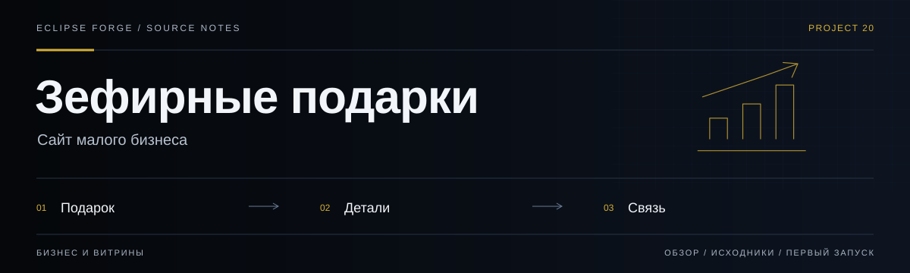
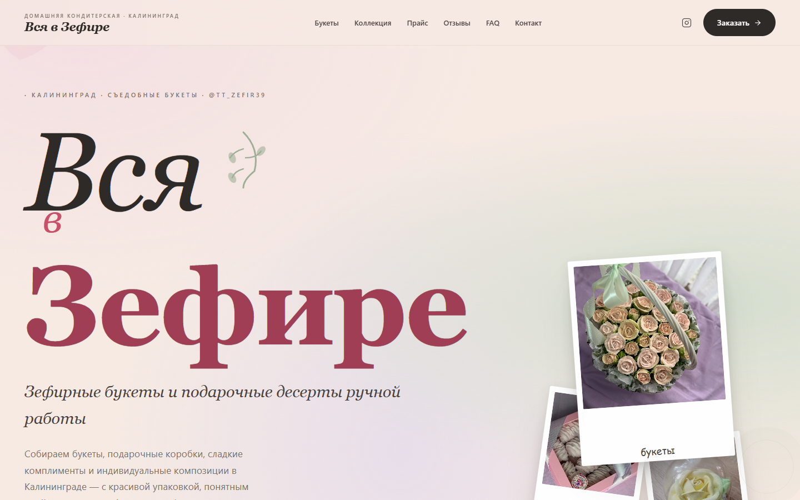

# Зефирные подарки



**Сайт малого бизнеса.** Статическая витрина подарочных наборов с галереей, информацией о заказе и контактами.

<!-- repository-guide:start -->
[Интерфейс](#readme-interface) · [Первый запуск](#readme-start) · [Что внутри](#readme-map) · [Путеводитель](docs/repository-guide.md#start) · [Карта кода](docs/repository-guide.md#map) · [Проверки](docs/repository-guide.md#checks) · [Границы и права](docs/repository-guide.md#boundaries)

<a id="readme-interface"></a>

## Интерфейс



**Первый экран «Вся в Зефире»: брендовая типографика и фотографии работ из локальных ресурсов.**

Локальный снимок от 8 сентября 2026: отдельный профиль браузера, без внешних API и пользовательских секретов. Это вид интерфейса, не подтверждение production-функций.

[Открыть в полном размере](docs/assets/ui/overview.png) · [Данные снимка](docs/assets/ui/capture.json)

<a id="readme-map"></a>

## Проект за минуту

- **[Контент в одном месте](<scripts/content.js>)** — Тексты, контакты, коллекции и галерея работ.
- **[Поведение страницы](<scripts/app.js>)** — Отображение секций и обработка взаимодействий.
- **[Оформление](<styles/main.css>)** — Палитра, типографика и адаптивная композиция.

<a id="readme-start"></a>

## Начать локально

**Среда:** Браузер, сборщик не нужен. **Источник:** [index.html](<index.html>).

Откройте `index.html` в браузере. Контент меняется в `scripts/content.js`, оформление — в `styles/main.css`.

<details>
<summary><strong>Перед первым запуском и изменением кода</strong></summary>

- Команды сверены с исходниками 8 сентября 2026. Это инструкция, а не отметка об успешном запуске или текущем production.
- Установка зависимостей может обращаться в registry и выполнять lifecycle scripts. Используйте отдельную рабочую среду и демонстрационные данные.
- Перед публичным использованием проверьте актуальность контактов, условий заказа и права на фотографии.


</details>
<!-- repository-guide:end -->

## Структура

```text
zefir-gift-landing/
├── assets/
│   ├── icons/
│   │   └── qr-placeholder.svg
│   └── images/
│       ├── hero-box-crop.jpg
│       ├── hero-box-reference.jpg
│       ├── secondary-reference.png
│       ├── work-box-1.jpg
│       ├── work-box-2.jpg
│       ├── work-bouquet-1.jpg
│       ├── work-bouquet-2.jpg
│       ├── work-bouquet-3.jpg
│       └── work-detail-1.jpg
├── scripts/
│   ├── app.js
│   └── content.js
├── styles/
│   └── main.css
├── index.html
└── README.md
```

## Где менять контент

Все тексты, ссылки, названия секций и галерея вынесены в:

- [content.js](scripts/content.js)

Основные блоки:

- `brand` — название и подпись бренда
- `nav` — пункты меню
- `hero` — первый экран
- `promos` — спецпредложения
- `collections` — основные направления
- `works` — галерея работ
- `benefits` — преимущества
- `process` — шаги заказа
- `contact` — финальный контактный блок
- `qr` — подпись к QR
- `assets` — главная картинка и QR

## Где менять галерею работ

В [content.js](scripts/content.js) ищи `works.items`.

У каждой работы есть:

- `title`
- `tag`
- `note`
- `image`
- `alt`
- `tone`

`tone` управляет размером карточки в сетке:

- `large`
- `square`
- `portrait`
- `poster`
- `placeholder`

## Где менять фото

Сейчас для витрины используются изображения из:

- [assets/images](assets/images)

Можно:

1. Заменить существующие файлы
2. Или поменять пути в `works.items[].image`
3. И отдельно поменять главный hero-image в `assets.heroImage`

## Где менять телефон и Telegram

В [content.js](scripts/content.js):

- `contact.telegram`
- `contact.telegramUrl`
- `contact.phone`
- `contact.phoneHref`

## Где менять цвета и стили

Все основные переменные лежат в начале:

- [main.css](styles/main.css)

В `:root` вынесены:

- цвета
- тени
- радиусы
- контейнер
- шрифты
- переходы

## Где менять структуру секций

Главная разметка:

- [index.html](index.html)

Логика рендера секций:

- [app.js](scripts/app.js)

## Как открыть

Проект статический, без сборщика.

Можно:

1. Открыть `index.html` в браузере
2. Или поднять любой простой local static server
